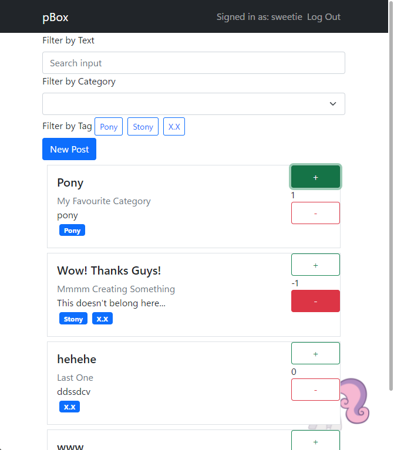

# pBox



## requirements
- node.js with npm

## running pBox under Docker
1. create a new postgresql docker (if you don't already have one)
```sh
docker pull postgres
```
```sh
docker run --name postgres-db \
    -e POSTGRES_PASSWORD=password \
    -p port:5432 \
    -d postgres
```
2. configure next.config.js to have unique ironKey
3. configure .env with the following example

you can find how to connect to other docker container IP addresses here: https://stackoverflow.com/a/54561221
```sh
DATABASE_URL="postgresql://postgres:password@ip:port/pbox?schema=public"
```
4. build the image for pBox
```sh
docker build --tag pbox .
```
5. run pBox in a new container
```sh
docker run --name pBox \
    -p post:6657
    --env-file .env
    -d pbox
```
6. it should work now. if not, report this please!

## running pBox for dev environment

1. clone the repo to a folder.
2. install the packages.
```sh
npm install
```
3. use the ORM tool to create a database and client for the code.

make sure to switch the database provider to `"sqlite"` and specify a file location with
the format `"file:./pbox.db"` as an example if you don't want to setup another
database. this can be done in `prisma/schema.prisma`

```sh
# setup the database
npx prisma migrate dev
# generate the client for the ORM to interact with the database
npx prisma generate
```
4. now you can start running the server.
```sh
npm run dev
``` 